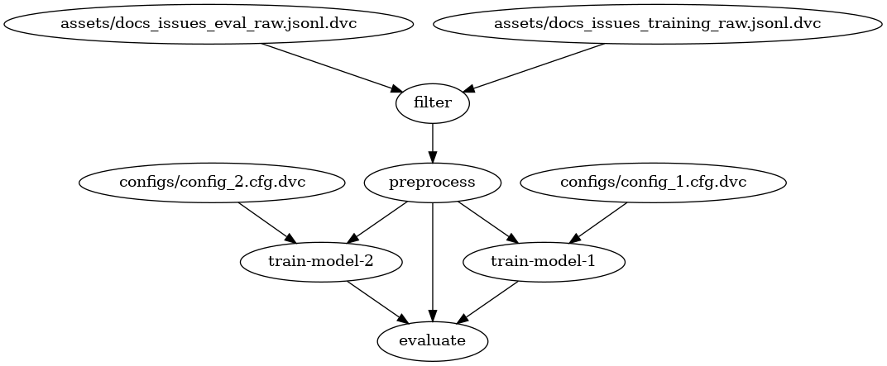

# dvc_vscode
How to use DVC pipelines and vscode notebook extensions to run Data Science experiments in Python

## Introduction
This is a repo that was done for a lecture for PyData Bristol on 10.2022 and for Data Bristol on 03.2023. 

This repo has the materials for a simple DVC pipeline and how to monitor results using VSCode notebook extension - check changes.

[Lecture from PyData Bristol](slides/DataScience_pipeline_DVC_and_VScode.pdf)

## Prerequisites
1. [Python 3.11](https://www.python.org/).
2. [Poetry](https://python-poetry.org/).
3. [Graphviz](https://graphviz.org/).
4. [VSCode](https://code.visualstudio.com/).

## Installation (on linux)

`git clone https://github.com/polecat-dev/talk-dvc-vscode.git`

`cd talk-dvc-vscode`

`poetry shell`

`pip install --upgrade pip`

`poetry install` (installing dependencies)

`python scripts/init_files.py`

## To start

### To reproduce the pipeline - 

`dvc repro`

### To visualise results - 

Go to [results](notebooks/results.ipynb).

Define your kernel (with the poetry virtualenv).

Run all cells.

Save notebook changes.

Go to source control VSCode extension to check results changes.

## How to visualise the pipeline

You can explore the pipeline in the [dvc.yaml](./dvc.yaml). 
To generate the graph visualization above, run: 

`poetry run dvc dag --dot | dot -Tpng > dag.png`

## Credits
Thanks to [PyData Bristol](https://github.com/pydatabristol) & [Data Bristol](https://www.meetup.com/databristol/) for the talk opportunity.

Thanks to [Polecat](https://www.polecat.com/) for the time and information sharing.

Thanks to [SpaCy](https://github.com/explosion/projects/tree/v3/tutorials/textcat_docs_issues) for the materials.

Thanks to [DVC](https://github.com/iterative/dvc).

Maintainer - [Alon Samuel](https://github.com/alon1samuel).
